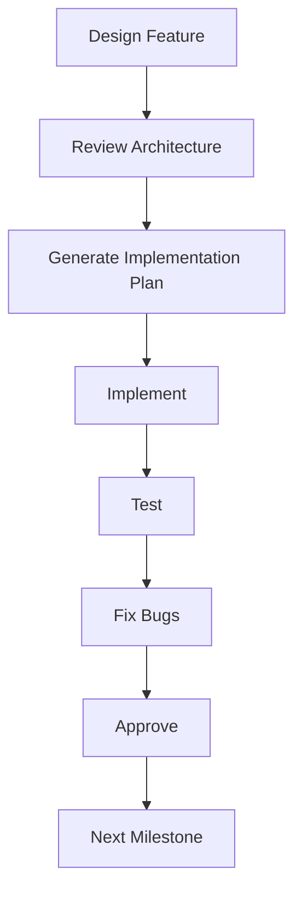

# AI DSA Mentor

# Master Project Blueprint

**Version:** 1.0  
**Status:** Planning  
**Document Owner:** Project Manager (ChatGPT)  
**Last Updated:** 30 June 2026

---

# Purpose

This document serves as the **single source of truth** for the AI DSA Mentor project.

Every AI assistant (ChatGPT, Codex, Claude, Gemini, etc.) and every developer working on the project should read this document before making architectural, design, or implementation decisions.

The purpose of this blueprint is to ensure that every feature, document, and line of code aligns with the project's vision and long-term goals.

---

# 1. Project Vision

## Goal

Build an AI-powered DSA learning platform that acts as a **personal mentor**, not just a problem tracker.

Instead of manually organizing learning resources, users should have a single platform that can:

- Generate structured learning plans
- Track progress automatically
- Remember solved questions
- Remember AI conversations
- Recommend what to study next
- Help debug code
- Provide hints before revealing solutions
- Store all learning history permanently

The application should feel like having a mentor that never forgets anything.

---

# 2. Problem Statement

## Current Workflow

```text
Ask ChatGPT
      ↓
Receive Question List
      ↓
Solve Problems
      ↓
Forget Which Problems Were Solved
      ↓
Ask Again
      ↓
Receive Duplicate Questions
      ↓
Lose Previous Discussions
      ↓
Repeat
```

## Problems

- No persistent memory
- No structured roadmap
- No centralized progress tracking
- AI loses previous context
- Learning organization is completely manual

---

# 3. Our Solution

AI DSA Mentor becomes the user's permanent learning companion.

The AI should always understand:

- Current topic
- Current learning plan
- Solved questions
- Attempted questions
- Previous hints
- Previous AI conversations
- Weak topics
- Strong topics

The user should never need to explain their learning history again.

---

# 4. Core Philosophy

## This is **NOT**

- A LeetCode tracker
- A spreadsheet
- A chatbot
- A note-taking application

## This **IS**

An intelligent learning platform that guides users throughout their entire DSA journey.

---

# 5. Four Pillars

Every feature added to the application must belong to one of these four pillars.

## 📚 Learn

The AI teaches and guides the learner.

Examples:

- Generate roadmaps
- Recommend questions
- Explain concepts
- Give hints
- Explain intuition

---

## 💻 Practice

The user actively solves problems.

Examples:

- Open LeetCode
- Solve questions
- Ask AI for help
- Take notes
- Mark questions as complete

---

## 📊 Track

The application remembers everything.

Examples:

- Progress
- Notes
- Attempts
- AI conversations
- Learning plans

---

## 🚀 Improve

The AI continuously analyzes progress.

Examples:

- Weakness detection
- Next topic recommendations
- Revision scheduling
- Daily goals

---

# 6. Target Users

## Primary Users

- College students preparing for placements

## Secondary Users

- Software engineers preparing for interviews

## Future Users

- Developers switching careers

---

# 7. MVP Scope

The first version of AI DSA Mentor will include:

- ✅ Authentication
- ✅ Dashboard
- ✅ AI Learning Plan Generator
- ✅ Learning Plans
- ✅ Question Pages
- ✅ Notes
- ✅ Progress Tracking
- ✅ AI Mentor

Everything else is deferred to future versions.

---

# 8. MVP Features

## Authentication

- Register
- Login
- Logout
- Persistent sessions

---

## Dashboard

Displays:

- Current learning plan
- Overall progress
- Continue learning
- Recent activity

---

## AI Learning Plan Generator

The user provides a topic they want to learn.

Example:

> "I learned Prefix Sum."

The AI responds with:

- Recommended problems
- Difficulty
- Reasoning
- LeetCode links
- Estimated solving time

The learning plan can then be saved permanently.

---

## Learning Plans

Stores:

- Topic
- Question list
- Progress
- Completion status
- Creation date

---

## Question Page

Each question stores:

- Problem title
- Difficulty
- LeetCode link
- Notes
- Attempts
- AI conversations
- Status

---

## AI Mentor

Capabilities:

- Hints
- Debugging
- Intuition
- Dry runs
- Complexity analysis
- Similar question recommendations

---

## Progress Tracking

Tracks:

- Overall progress
- Topic progress
- Questions solved
- Questions attempted
- Questions skipped

---

# 9. Development Rules

Every feature must satisfy the following rules.

## Rule 1

Never recommend already solved questions.

---

## Rule 2

The AI must understand the user's current learning plan.

---

## Rule 3

All important user actions must be stored permanently.

---

## Rule 4

Progress must survive logout.

---

## Rule 5

Features should remain modular.

---

## Rule 6

Avoid unnecessary complexity.

---

## Rule 7

Never break existing functionality when adding new features.

---

# 10. Development Workflow

Every milestone follows the same process.



No milestone begins until the previous one is complete.

---

# 11. Team Responsibilities

## ChatGPT

**Role:** Technical Lead

Responsibilities:

- Product planning
- System architecture
- Database design
- Backend design
- AI prompt engineering
- Debugging
- Milestone planning
- Reviewing implementations

---

## Codex

**Role:** Implementation Engineer

Responsibilities:

- Build frontend
- Build backend
- Create APIs
- Connect database
- Refactor code

---

## Claude

**Role:** Senior Reviewer

Responsibilities:

- Review architecture
- Find bugs
- Suggest improvements
- Explain complex code

---

## Project Owner

Responsibilities:

- Test every milestone
- Report bugs
- Approve completed features
- Decide product direction

---

# 12. Project Phases

| Phase | Status |
|--------|--------|
| Product Design | ✅ Completed |
| System Design | 🔄 In Progress |
| Database Design | ⏳ Pending |
| Backend Architecture | ⏳ Pending |
| UI Design | ⏳ Pending |
| Development | ⏳ Pending |
| Testing | ⏳ Pending |
| Deployment | ⏳ Pending |

---

# 13. Current Mission

The project is currently in the planning phase.

## Current Milestone

**System Design**

This includes:

- Selecting technologies
- Designing project architecture
- Defining folder structure
- Planning backend responsibilities
- Planning frontend responsibilities
- Designing AI integration
- Designing authentication flow

Implementation begins only after the system design is finalized.

---

# 14. Working Agreement

From this point onward:

- This document is the project's master blueprint.
- Every new feature should be reflected here before implementation.
- Every AI assistant should read this document before writing code.
- Major architectural decisions must update this document.
- The project will evolve as a single codebase.
- Every milestone must be completed, tested, and approved before moving to the next.

---

# Guiding Principle

> **Build the simplest solution that fulfills the vision.**

Avoid unnecessary complexity.

Prioritize maintainability over cleverness.

Every feature should provide clear value to the learner.

If a feature does not improve learning, tracking, or guidance, it should not be included in the MVP.
